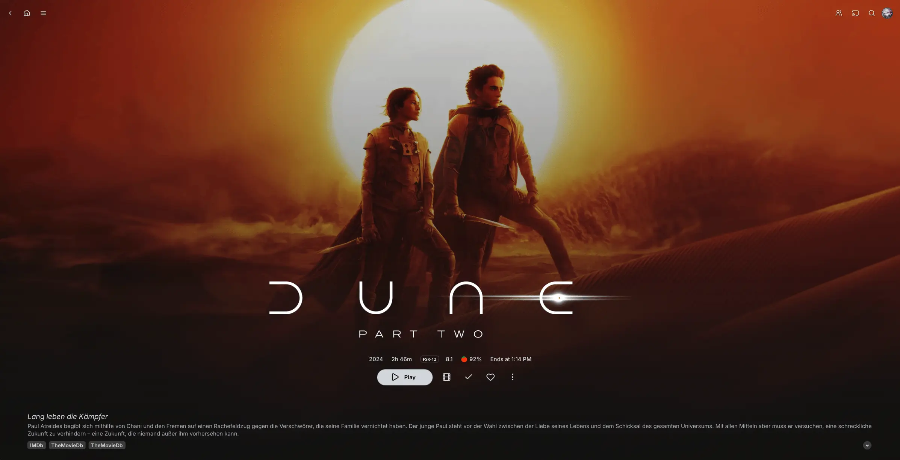
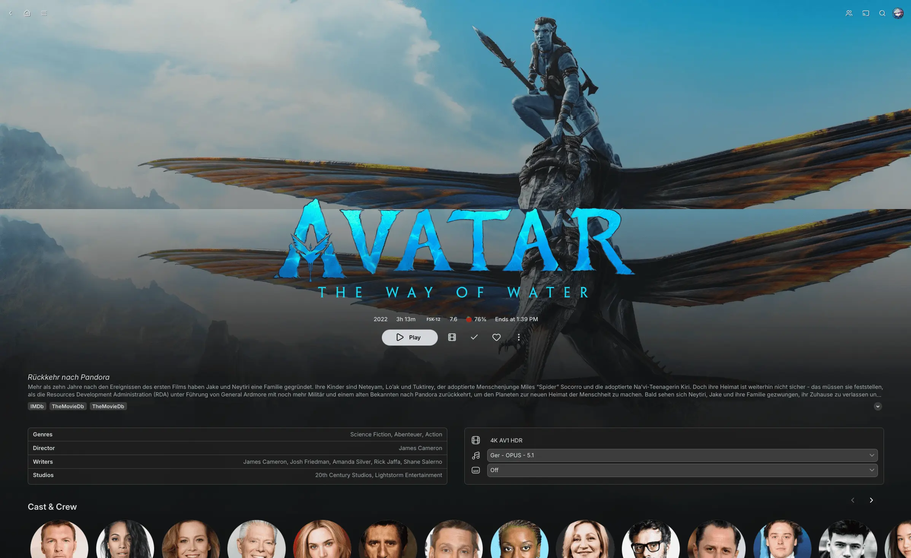
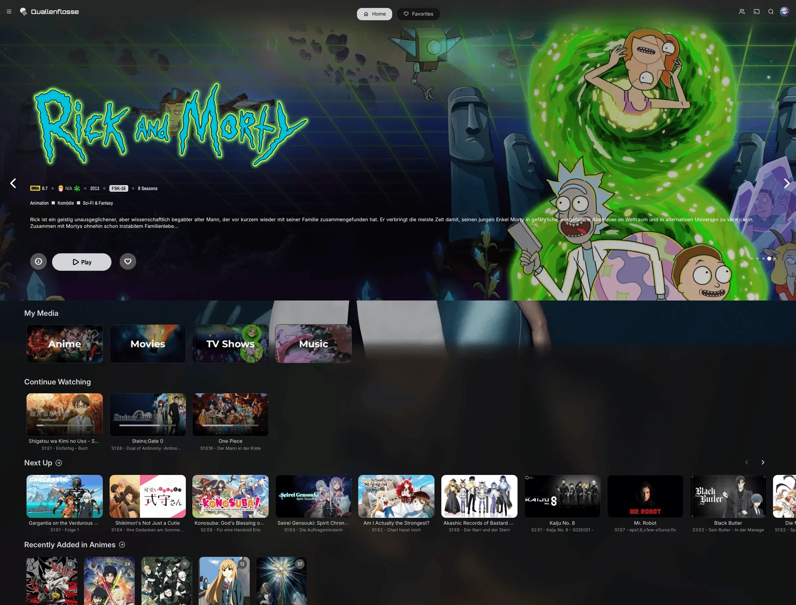

# NeutralFin Theme

NeutralFin is a custom Jellyfin theme inspired by [lscambo13's ElegantFin](https://github.com/lscambo13/ElegantFin), featuring a sleek black and grey color scheme for a more neutral and modern look.

The preview images also use the [Jellyfin Lucide](https://github.com/KartoffelChipss/Jellyfin-Lucide) theme for more modern icons.

For this theme to look best, we also recommend enabling backdrops in your Jellyfin settings.



## 📦 Install

You can install this theme by pasting the following code into the custom CSS box:

```css
@import url('https://cdn.jsdelivr.net/gh/KartoffelChipss/NeutralFin@latest/theme/neutralfin-minified.css');
```

<details>
  <summary><strong>Detailed steps for server-side implementation (Theme is applied to everyone)</strong></summary>

1. Go to **Settings** → **Administration** tab.
2. Select the **General** tab from the sidebar.
3. Scroll to the **Branding** section.
4. Locate the **Custom CSS** field.
5. Paste your custom CSS into the box.
6. Click **Save** to apply the changes.

</details>

<details>
  <summary><strong>Detailed steps for client-side implementation (Theme is only applied to you)</strong></summary>

1. Go to **Settings** → **Display** tab.
2. Scroll down to find the **Custom CSS** field.
3. Paste your custom CSS into the box.
4. Click **Save** to apply the changes.

</details>

## 👀 Previews

<details>
    <summary><strong>Movie Page Preview</strong></summary>



</details>

<details>
    <summary><strong>Home Page Preview</strong></summary>



</details>

<details>
    <summary><strong>Movie List Page Preview</strong></summary>


</details>

<details>
    <summary><strong>Dashboard Preview</strong></summary>


</details>

## ⚖️ License and Credits

NeutralFin is a modified version of the [ElegantFin](https://github.com/lscambo13/ElegantFin) theme by [lscambo13](https://github.com/lscambo13), originally licensed under the [GNU General Public License v2.0](https://www.gnu.org/licenses/old-licenses/gpl-2.0.html).

### Modifications by KartoffelChipss:

-   Applied a neutral black and grey color scheme
-   Fix media bar plugin container position
-   Fix media bar buttons consistency
-   Minor CSS refinements

This project remains under the **GNU GPL-2.0 license**.  
You are free to use, modify, and redistribute it under the same terms.

> **Disclaimer:** This project is an independent work and is not affiliated with, endorsed by, or officially associated with the Jellyfin project or its developers.

> **Content Disclaimer:** Movie posters and media shown in the previews are for demonstration purposes only. All media content is the property of their respective copyright holders and is not included with this theme.
